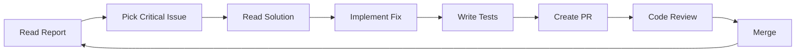
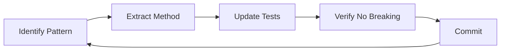
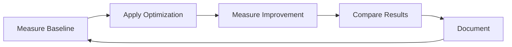

# 🎓 Tóm Tắt: Hướng Dẫn Sử Dụng Code Review Skills

## 📚 BẠN VỪA NHẬN ĐƯỢC GÌ?

Tôi vừa tạo cho bạn **3 documents chuyên nghiệp** về Code Review từ góc nhìn **Senior Java Spring Boot Developer 10 năm kinh nghiệm**:

### 1️⃣ CODE_REVIEW_REPORT.md (1500+ dòng)
**Là gì**: Full code review report với analysis chi tiết  
**Nội dung**: 12 critical issues + solutions + best practices  
**Dùng khi**: Cần hiểu sâu về vấn đề và cách fix  

### 2️⃣ CODE_REVIEW_USAGE_GUIDE.md (500+ dòng)  
**Là gì**: Hướng dẫn từng bước cách dùng report  
**Nội dung**: Workflow cho từng vai trò + tools + tracking  
**Dùng khi**: Lần đầu đọc report, muốn biết bắt đầu từ đâu  

### 3️⃣ QUICK_REFERENCE.md (300+ dòng)
**Là gì**: Cheat sheet ngắn gọn, in ra dán bàn  
**Nội dung**: Top 5 critical fixes + quick patterns + commands  
**Dùng khi**: Đang code, cần xem nhanh  

---

## 🚀 BẮT ĐẦU NGAY (5 PHÚT)

### Bước 1: Mở Files (1 phút)
```bash
cd /Users/ADMIN/Desktop/Wordspace/Programing/Java/ticket-system/.github

# Mở trong VS Code hoặc IDE
code CODE_REVIEW_REPORT.md
code CODE_REVIEW_USAGE_GUIDE.md
code QUICK_REFERENCE.md
```

### Bước 2: Đọc Executive Summary (2 phút)
Mở **CODE_REVIEW_REPORT.md** → Đọc phần đầu:
- Overall Score: 6/10
- Security: 5/10 
- 12 Critical Issues
- Action Items

**Mục tiêu**: Hiểu tình trạng tổng quan

### Bước 3: Xác Định Priority (2 phút)
Xem **QUICK_REFERENCE.md** → Section "TOP 5 CRITICAL":

1. ✅ Hardcoded ADMIN role (30 min)
2. ✅ Hardcoded secrets (15 min)
3. ✅ Missing @Transactional (1h)
4. ✅ Password encoder (20 min)
5. ✅ Race condition (1h)

**Mục tiêu**: Biết fix gì trước

---

## 👨‍💻 CHO DEVELOPER

### Morning Routine (30 phút)
```markdown
1. ☕ Uống cà phê
2. 📖 Mở QUICK_REFERENCE.md
3. 🎯 Pick 1 issue từ TOP 5
4. 📚 Đọc chi tiết trong CODE_REVIEW_REPORT.md
5. ✍️ Plan cách fix
```

### Coding Time (2-3 giờ)
```markdown
1. 🔧 Implement fix theo pattern trong QUICK_REFERENCE
2. ✅ Write/update tests
3. 🧪 Run tests locally
4. 📝 Commit với message chuẩn
5. 🔄 Create PR
```

### Example: Fix Hardcoded ADMIN (30 phút)
```java
// Step 1: Locate issue
File: JwtAuthFilter.java
Line: 66

// Step 2: Apply fix (from QUICK_REFERENCE.md)
// ❌ BEFORE
List<GrantedAuthority> authorities =
    Collections.singletonList(new SimpleGrantedAuthority("ADMIN"));

// ✅ AFTER
String role = jwtUtil.getRoleFromToken(jwtToken);
List<GrantedAuthority> authorities =
    Collections.singletonList(new SimpleGrantedAuthority("ROLE_" + role));

// Step 3: Test
- Login with ADMIN role → verify can access admin APIs
- Login with CUSTOMER role → verify cannot access admin APIs

// Step 4: Commit
git commit -m "[SECURITY] Fix hardcoded ADMIN authority

- Extract role from JWT token instead of hardcoded
- Fixes critical security vulnerability
- Ref: CODE_REVIEW_REPORT.md section 1.2"
```

### Daily Progress
```markdown
End of day checklist:
✅ 1-2 issues fixed
✅ Tests written
✅ PR created
✅ Progress updated
```

---

## 👨‍💼 CHO TECH LEAD

### Week 1: Setup & Planning (4 giờ)

#### 1. Đọc Full Report (2 giờ)
```bash
# Đọc toàn bộ
code CODE_REVIEW_REPORT.md

# Take notes:
- Critical issues (5 items)
- High priority (7 items)
- Effort estimation
- Dependencies
```

#### 2. Create Action Plan (1 giờ)
```markdown
# Sprint Planning

## Week 1 (Critical Fixes)
- Issue 1.1: Hardcoded secrets → @dev1
- Issue 1.2: Hardcoded ADMIN → @dev2
- Issue 1.3: Password encoder → @dev3
- Issue 6.1: @Transactional → @dev1
- Issue 6.2: Race conditions → @dev2

## Week 2 (Refactoring)
- Issue 3.1: Field injection → @all
- Issue 4.1: Duplicate code → @dev1
- Issue 8.1: Logging → @dev2

## Week 3 (Testing)
- Unit tests → @all
- Integration tests → @dev1, @dev2
```

#### 3. Setup Tools (1 giờ)
```bash
# SonarQube
docker run -d -p 9000:9000 sonarqube

# Git hooks
cp .github/hooks/pre-commit .git/hooks/
chmod +x .git/hooks/pre-commit

# Configure CI/CD
# (Add SonarQube to pipeline)
```

### Weekly Routine

#### Monday Morning (1 giờ)
```markdown
- Review last week progress
- Plan this week tasks
- Assign issues to developers
- Schedule knowledge sharing
```

#### Mid-week (30 phút/day)
```markdown
- Code review PRs
- Unblock developers
- Track progress
```

#### Friday Afternoon (1 giờ)
```markdown
- Sprint retrospective
- Update metrics
- Plan next week
```

---

## 🎯 WORKFLOW TỐI ƯU

### Phase 1: Critical Fixes (Week 1-2)


**Focus**: Security vulnerabilities & data integrity

### Phase 2: Refactoring (Week 3-4)


**Focus**: Code quality & maintainability

### Phase 3: Optimization (Week 5-6)


**Focus**: Performance & scalability

---

## 📊 METRICS & TRACKING

### Daily Dashboard
```markdown
## Today's Progress

### Completed ✅
- Fixed hardcoded ADMIN authority
- Added @Transactional to TicketService
- Wrote unit tests for AuthService

### In Progress 🔨
- Extracting duplicate validation logic (70%)

### Blocked 🚫
- None

### Tomorrow's Plan 📅
- Complete validation extraction
- Fix password encoder bean
- Start with field injection refactor
```

### Weekly Metrics
```markdown
| Metric | Week 1 | Week 2 | Target | Status |
|--------|--------|--------|--------|--------|
| Issues Fixed | 3 | 8 | 20 | 🟡 On Track |
| Code Coverage | 10% | 25% | 80% | 🔴 Behind |
| SonarQube | 6.0 | 6.5 | 8.0 | 🟡 Improving |
| Critical Issues | 5 | 2 | 0 | 🟢 Good |
```

---

## 🛠️ TOOLS & COMMANDS

### Quick Checks
```bash
# Find hardcoded secrets
grep -r "password=" --include="*.properties" .

# Find System.out.println
grep -r "System.out" --include="*.java" src/

# Find field injection
grep -r "@Autowired" src/ | grep "private"

# Run tests
mvn clean test

# Check code quality
mvn sonar:sonar
```

### Git Workflow
```bash
# Start new fix
git checkout -b fix/hardcoded-admin-authority

# Make changes
# ...

# Commit
git add .
git commit -m "[SECURITY] Fix hardcoded ADMIN authority

- Extract role from JWT token
- Add tests for role extraction
- Ref: CODE_REVIEW_REPORT.md section 1.2"

# Push
git push origin fix/hardcoded-admin-authority

# Create PR on GitHub
```

---

## 💡 PRO TIPS

### Tip 1: Start Small, Win Big
```markdown
❌ Don't:
- Try to fix everything at once
- Make big changes without tests
- Create huge PRs (>500 lines)

✅ Do:
- Fix ONE issue completely
- Add tests FIRST
- Small PRs (<300 lines)
- Commit frequently
```

### Tip 2: Learn from Examples
```markdown
Best learning path:
1. Read issue in CODE_REVIEW_REPORT.md
2. Look at ❌ BEFORE code
3. Understand why it's bad
4. Look at ✅ AFTER code
5. Understand why it's better
6. Apply to your code
7. Test thoroughly
```

### Tip 3: Ask for Help
```markdown
When stuck:
1. Search in documents first
2. Check QUICK_REFERENCE.md
3. Ask in Slack #code-review-help
4. Schedule pairing with senior
5. Document learnings
```

---

## 🎓 LEARNING PATH

### Week 1: Security Fundamentals
- [ ] Read all Security issues (1.x, 9.x)
- [ ] Fix 2 critical security bugs
- [ ] Research OWASP Top 10
- [ ] Write security test cases

### Week 2: Clean Code Practices
- [ ] Read all Code Quality issues (2.x, 3.x, 4.x, 7.x)
- [ ] Refactor 1 service completely
- [ ] Extract duplicate logic
- [ ] Add proper logging

### Week 3: Performance Optimization
- [ ] Read all Performance issues (5.x, 6.x)
- [ ] Fix N+1 queries
- [ ] Add database indexes
- [ ] Measure improvements

### Week 4: Testing & Documentation
- [ ] Write unit tests (target 80%)
- [ ] Add integration tests
- [ ] Document API changes
- [ ] Update README

---

## 📞 SUPPORT & HELP

### Documents
- [📄 CODE_REVIEW_REPORT.md](CODE_REVIEW_REPORT.md) - Full report
- [📖 CODE_REVIEW_USAGE_GUIDE.md](CODE_REVIEW_USAGE_GUIDE.md) - Detailed guide
- [🎯 QUICK_REFERENCE.md](QUICK_REFERENCE.md) - Quick fixes

### Channels
- **Slack**: #code-review-help
- **Email**: tech-lead@company.com
- **1-on-1**: Schedule with senior developers

### Resources
- Spring Security Reference
- Clean Code Book
- Effective Java Book
- Baeldung Tutorials

---

## ✅ SUCCESS CHECKLIST

### This Week
- [ ] Read all 3 documents
- [ ] Fix 1-2 critical issues
- [ ] Write tests for fixes
- [ ] Create clean PRs
- [ ] Update progress tracker

### This Month
- [ ] All critical issues fixed
- [ ] Code quality improved
- [ ] Team knowledge shared
- [ ] Monitoring setup

### This Quarter
- [ ] All issues resolved
- [ ] Tests >80% coverage
- [ ] Performance optimized
- [ ] Production ready

---

## 🎉 CELEBRATE WINS

```markdown
Small wins matter!

🎊 After fixing 1 critical issue:
   → High five with team!

🎊 After fixing all critical issues:
   → Team lunch celebration!

🎊 After code quality >8.0:
   → Present learnings to company!

🎊 After test coverage >80%:
   → Write blog post!
```

---

## 🚀 NEXT ACTIONS

### Today (10 phút)
1. ✅ Đọc document này xong
2. ✅ Mở QUICK_REFERENCE.md
3. ✅ Pick 1 issue để fix

### Tomorrow (Cả ngày)
1. ✅ Implement fix
2. ✅ Write tests
3. ✅ Create PR
4. ✅ Get review

### This Week
1. ✅ Fix 2-3 issues
2. ✅ Help teammates
3. ✅ Track progress
4. ✅ Celebrate wins!

---

## 💬 FEEDBACK

Nếu có câu hỏi hoặc cần giúp đỡ:

📧 **Email**: namsongc98@gmail.com  
💬 **Slack**: #ticket-system  
📝 **GitHub**: Create issue với label `question`  

---

**Good luck with your code improvements! 🚀**

*"The only way to go fast is to go well."* - Uncle Bob

---

**Last Updated**: April 9, 2026  
**Author**: Senior Java Spring Boot Developer (10 Years)  
**Version**: 1.0.0

